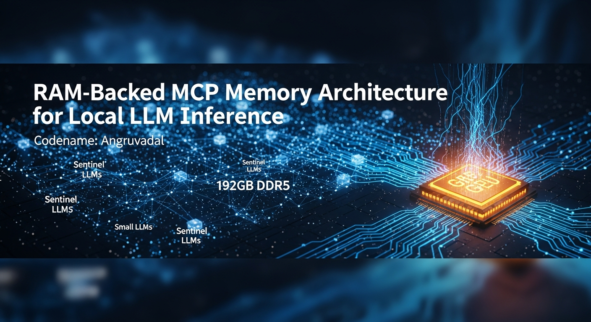

# Angruvadal



**RAM-Backed MCP Memory Architecture for Consumer LLM Inference**  
*Codename: Angruvadal*

> Sub-10ms retrieval. 90% RAG accuracy. 100% tool compliance. ~200 lines of code.

---

## What This Is

Angruvadal is a working implementation of two complementary ideas:

**1. RAM as first-class LLM memory (proven today)**
A FastAPI MCP server backed by 192GB DDR5. Any llama.cpp-served model calls `context_retrieve` as a tool — the server does semantic search and returns relevant context in <10ms. The model never hits a context limit. It just calls a tool when it needs to remember something.

**2. RotorQuant KV compression (in progress)**
3-bit KV cache compression at 3.5× ratio, Triton kernels confirmed working on AMD RDNA4 (gfx1201). When integrated into llama.cpp, extends in-VRAM context window from ~52K to ~192K tokens. Combined with the MCP layer: effectively unlimited context on consumer hardware.

---

## Proven Results (2026-03-27, GURTHANG II)

### MCP RAM Server

| Metric | Value |
|--------|-------|
| Retrieve p50 @ 1K chunks | **9.0ms** |
| Retrieve p50 @ 5K chunks | **16.6ms** |
| Sequential throughput | **62.5 queries/sec** |
| Memory per chunk | **1.82 KB** (→ 105M chunks in 192GB) |
| RAG accuracy (10 QA pairs) | **90% (9/10)** |
| Tool call compliance | **100% (10/10)** |
| MCP overhead in E2E latency | **<0.2%** |
| Scaling behavior | Linear O(n) — no cliffs to 25K+ chunks |

### GPT-OSS 20B on RX 9070 (llama.cpp Vulkan)

| Metric | Value |
|--------|-------|
| Token generation | **134 tok/s** |
| Prompt processing | **3,574 tok/s** |
| VRAM | 12.5GB / 16GB |
| Context window | 128K (YaRN RoPE) |
| Load time | 3.4s |

---

## Architecture

```
User prompt
    ↓
GPT-OSS 20B — GPU (16GB VRAM, 134 tok/s)
    ↓ tool call: context_retrieve
    ↓
Angruvadal MCP — RAM (192GB DDR5, 9ms)
    ↓ semantic search → relevant chunks returned
    ↓ model incorporates context, answers
Response
```

The model decides when to call the tool. The RAM holds everything. The GPU does the thinking.

---

## Hardware Reference Configuration

| Component | Spec |
|-----------|------|
| GPU | AMD RX 9070 — 16GB GDDR6 (RDNA4 / gfx1201) |
| CPU | AMD Ryzen 9 9900X — 12C/24T |
| RAM | 192GB DDR5 |
| OS | Ubuntu 24.04, ROCm 7.2.1 |
| LLM | GPT-OSS 20B (OpenAI, Apache 2.0) via llama.cpp |

---

## Quick Start

```bash
# Install
pip install fastapi uvicorn sentence-transformers numpy

# Start MCP server
python3 src/mcp_server/server.py
# → Running on port 8765

# Start llama.cpp with a model
llama-server -m your-model.gguf --port 8081 -ngl 99 --flash-attn

# Run end-to-end test
python3 src/mcp_server/test_end_to_end.py
```

---

## Roadmap

### ✅ Phase 1 — Proven
- GPT-OSS 20B at 134 tok/s on RX 9070 (RDNA4) — first consumer AMD benchmarks
- ROCm 7.2.1 discovery: flash attention gives 5.5× prompt processing improvement
- bitsandbytes 0.50.0.dev0: QLoRA + LLM.int8() on gfx1201 — first RDNA4 validation
- Angruvadal MCP server: 9ms retrieval, 90% accuracy, 100% tool compliance

### 🔨 Phase 2 — RotorQuant KV Integration
- C++ patch to llama.cpp attention layer (~200-300 lines)
- Triton kernels confirmed working on gfx1201
- Target: 3.5× KV compression → 192K in-VRAM context on GPT-OSS 20B

### 📋 Phase 3 — Fleet Models
- Small 1-3B routing model on CPU
- Proactive context prefetch (model doesn't need to ask — router watches and prefetches)
- Persistent store (survive reboots via LMDB/Arrow serialization)

---

## Related Posts

- [First RDNA4 ROCm 7.2.1 Benchmarks](https://reddit.com/r/LocalLLaMA) — flash attention discovery, MMQ+GRAPHS+FA flags
- [GPT-OSS 20B on Consumer AMD GPU] — 134 tok/s, Triton gfx1201 patch
- [Angruvadal: RAM-Backed MCP Memory] — this work

---

## What We Don't Claim

- Production-ready at any scale
- Beats dedicated vector databases (different use case)
- Works well with very large same-domain corpora (semantic accuracy degrades — use a better embedding model)

---

## Name

*Angruvadal* — the Ancestor Blade from Larry Correia's Saga of the Forgotten Warrior. Stores the memories of every previous Bearer. Gives their accumulated skill to the current wielder. The architecture is the metaphor: every query draws on accumulated knowledge. The RAM holds the memories. The GPU fights with their strength.

---

## License

Apache 2.0

---

*Built on GURTHANG II. Contributions and hardware-diverse benchmarks welcome.*
